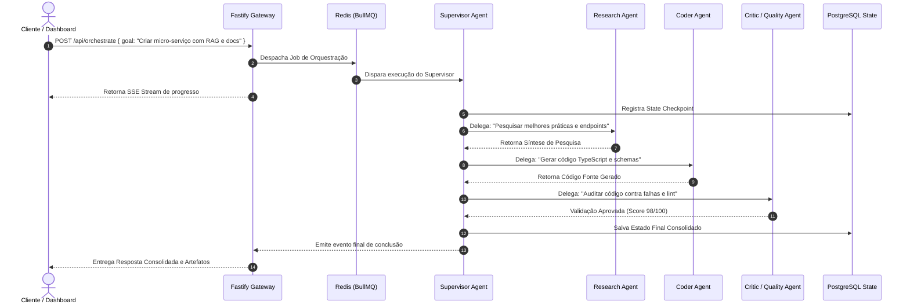

# 🤖 Multi-Agent Orchestrator Node.js — Autonomous Distributed AI Agent Framework

<p align="center">
  
</p>

<p align="center">
  <strong>Enterprise-grade, distributed Multi-Agent Orchestration platform built with Node.js, TypeScript, Fastify, LangGraph / LangChain, Redis BullMQ, and PostgreSQL.</strong>
</p>

<p align="center">
  <a href="#-architecture--multi-agent-system"></a>
  <a href="#-agent-roles--capabilities"></a>
  <a href="LICENSE"></a>
</p>

<p align="center">
  
  
  
  
  
  
  
</p>

---

## 📌 Visão Geral & Proposta de Valor

O **Multi-Agent Orchestrator Node** é um framework distribuído para orquestração, supervisão e execução cooperativa de **Agentes de IA Autônomos**. Permite resolver fluxos complexos de negócios dividindo tarefas massivas entre múltiplos agentes especializados orientados por um **Supervisor (Agent Leader)**.

### 🚀 Destaques da Plataforma:
- **Hierarchical Supervisor Architecture**: Padrão de orquestração onde um agente supervisor analisa a intenção, delega sub-tarefas para agentes especialistas e consolida o resultado.
- **Asynchronous Task Queue com Redis & BullMQ**: Execução paralela e tolerante a falhas de tarefas com controle de retentativas, dead-letter queues e prioridades.
- **Persistent State & Memory Graph**: Persistência de estado de execução e histórico de mensagens no PostgreSQL.
- **Tool Calling & Sandboxed Execution**: Capacidade de chamada a ferramentas externas (APIs, busca web, executores de código, scrapers).
- **Real-Time Agent-to-Client Streaming**: Transmissão em tempo real do fluxo de pensamento dos agentes via **Server-Sent Events (SSE)**.

---

## 🏛️ Arquitetura do Sistema (Multi-Agent Engine)

```text
+---------------------------------------------------------------------------------------------------------+
|                                    CLIENTS & API CONSUMERS (Web / CLI / Bots)                           |
+---------------------------------------------------------------------------------------------------------+
                                                     │
                                                     │ HTTP REST / SSE Stream (/api/orchestrate)
                                                     ▼
+---------------------------------------------------------------------------------------------------------+
|                                 FASTIFY ORCHESTRATOR API & GATEWAY                                      |
|                                                                                                         |
|   • Schema Validation (Zod)         • Rate Limiter & Auth        • SSE Event Stream Publisher           |
+---------------------------------------------------------------------------------------------------------+
                                                     │
                                                     │ Enqueue Workflow Jobs
                                                     ▼
+---------------------------------------------------------------------------------------------------------+
|                                  REDIS BULLMQ DISTRIBUTED TASK ENGINE                                   |
|                                                                                                         |
|   • Priority Queues             • Concurrency Manager            • Dead-Letter Queue & Retries          |
+---------------------------------------------------------------------------------------------------------+
                                                     │
                                                     ▼
+---------------------------------------------------------------------------------------------------------+
|                                SUPERVISOR AGENT (Orchestrator Leader)                                   |
|                        Decompõe o problema e orquestra a máquina de estados                             |
+---------------------------------------------------------------------------------------------------------+
              │                                      │                                      │
              ▼                                      ▼                                      ▼
+───────────────────────────+          +───────────────────────────+          +───────────────────────────+
|      RESEARCH AGENT       |          |        CODER AGENT        |          |       CRITIC AGENT        |
|  • Web Search Scraper     |          |  • Code Generation        |          |  • Output Verification    |
|  • Knowledge Extraction   |          |  • Syntax & AST Analyzer  |          |  • Security & Fact Check  |
+───────────────────────────+          +───────────────────────────+          +───────────────────────────+
              │                                      │                                      │
              └──────────────────────────────────────┴──────────────────────────────────────┘
                                                     │
                                                     ▼
+---------------------------------------------------------------------------------------------------------+
|                                     POSTGRESQL STATE & MEMORY STORE                                     |
|                       Checkpoints de execução, memória episódica e auditoria                            |
+---------------------------------------------------------------------------------------------------------+
```

---

## 🤖 Catálogo de Agentes & Funções

| Agente | Tipo | Responsabilidade | Ferramentas Acopladas |
|---|---|---|---|
| **Supervisor Agent** | Orquestrador | Planeja, divide tarefas em DAGs, delega e valida entregas. | Router, Graph Planner, Context Consolidator |
| **Research Agent** | Especialista | Coleta dados externos, sintetiza referências e sumariza fatos. | Web Search Tool, Content Scraper, URL Parser |
| **Coder Agent** | Especialista | Escreve código limpo, modular, documentado e tipado. | Code Generator, Syntax Validator, Sandbox |
| **Critic / Reviewer** | Auditor | Inspeciona respostas contra alucinações, falhas e segurança. | Fact-Checker, Vulnerability Scanner |

---

## 🧠 Diagrama de Sequência (Execução Cooperativa)



---

## 🛠️ Tech Stack

- **Runtime & Core**: Node.js 20+, TypeScript 5.x
- **HTTP Engine**: Fastify com suporte a Server-Sent Events (SSE)
- **Fila & Mensageria**: Redis + BullMQ (Execução paralela desacoplada)
- **Framework de Agentes**: LangChain / LangGraph JS State Graph
- **Banco de Dados**: PostgreSQL 16 (State Checkpoints & Memory)
- **Validação & Logs**: Zod Schemas + Pino JSON Logger
- **Testes & CI/CD**: Vitest + GitHub Actions

---

## ⚙️ Quickstart & Instalação

### 1. Clonar e Instalar
```bash
git clone https://github.com/dev-rodrigues00/multi-agent-orchestrator-node.git
cd multi-agent-orchestrator-node
npm install
cp .env.example .env
```

### 2. Subir Infraestrutura (PostgreSQL + Redis)
```bash
docker compose up -d
```

### 3. Rodar em Desenvolvimento
```bash
npm run dev
```

---

## 🛡️ Licença

Distribuído sob a licença **MIT Open Source**. Consulte o arquivo [LICENSE](LICENSE) para mais detalhes.

---

<p align="center">
  <sub>Construído por <strong>Dev Rodrigues</strong> • Multi-Agent Autonomous Orchestration 2026. 🚀</sub>
</p>
